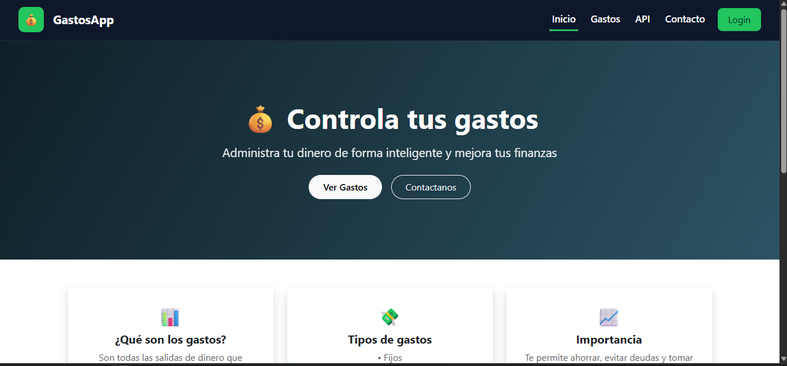
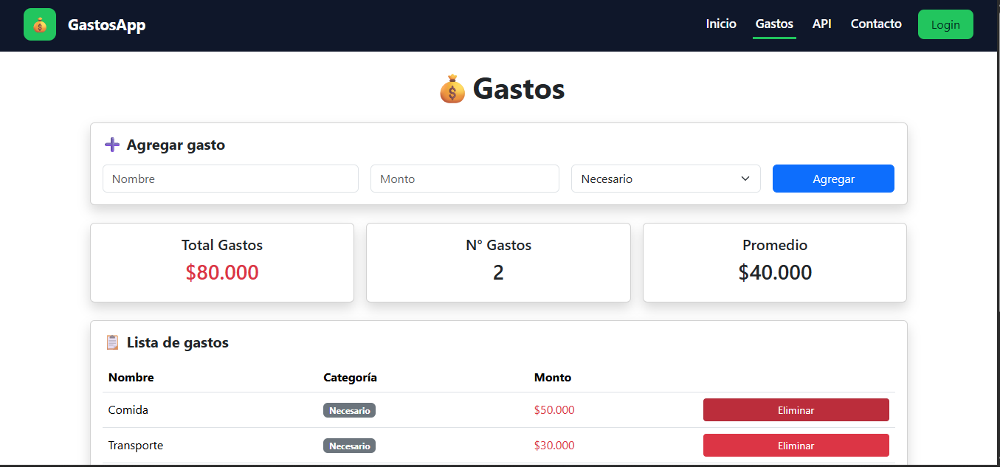
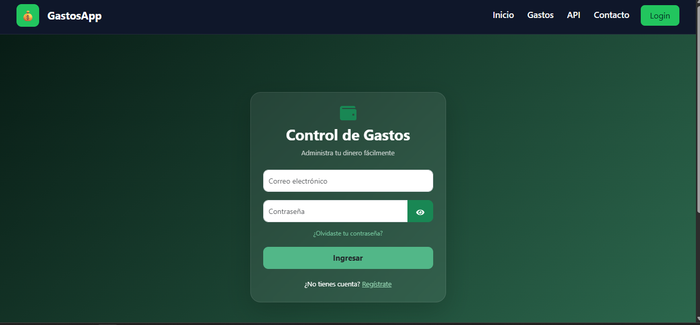
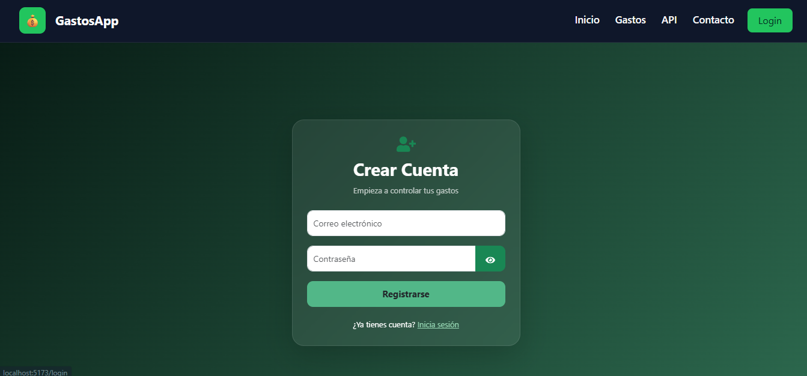
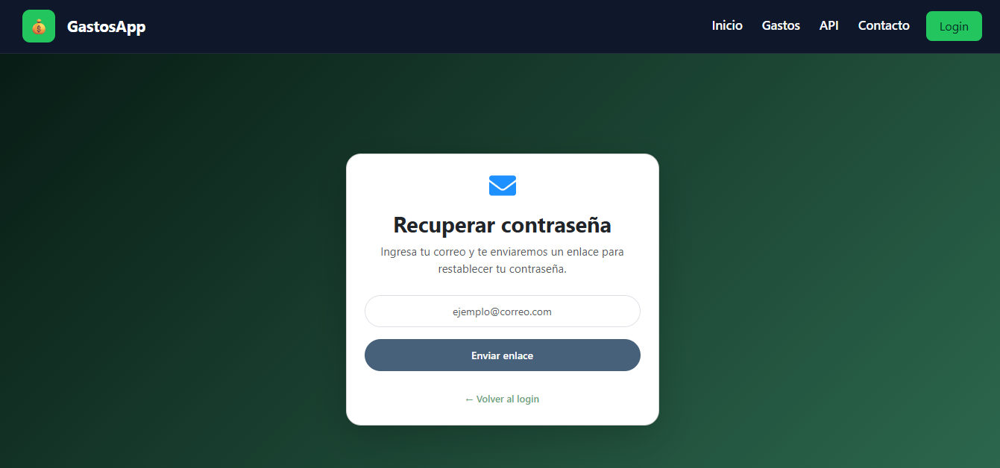
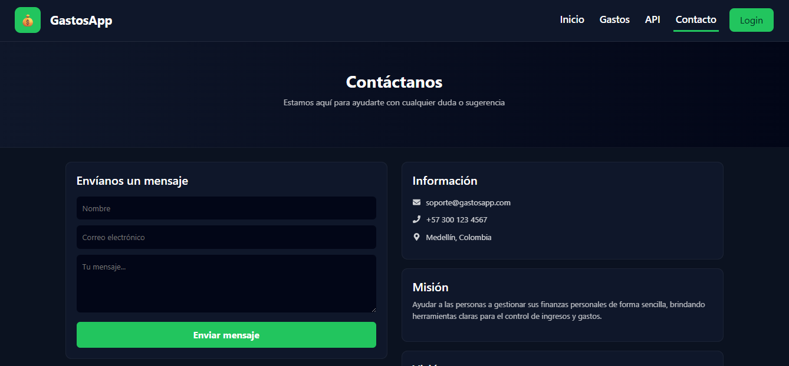

# 🚀 Sistema de Autenticación Full Stack

## 📌 Nombre del Proyecto

Sistema de Autenticación con React ⚛️, Node.js 🟢 y MongoDB 🍃

---

## 📖 Descripción

Aplicación web full stack que permite el registro e inicio de sesión de usuarios con validación de credenciales. El frontend está desarrollado con React y el backend con Node.js, utilizando MongoDB como base de datos.

Inicialmente, el proyecto fue implementado y probado en MongoDB Compass de forma local y posteriormente fue migrado a MongoDB Atlas para permitir conexiones remotas y despliegue en la nube.

---

## ✨ Características Principales

* 📝 Registro de usuarios
* 🔐 Inicio de sesión con validación
* ❌ Manejo de errores en autenticación
* 🔗 Conexión a base de datos MongoDB
* 🌐 API REST
* ⚡ Interfaz moderna con React y Vite
* 📁 Estructura modular organizada

---

## ⚙️ Instalación

### 📥 Clonar repositorio

```bash id="k8zgh3"
git clone <URL_DEL_REPOSITORIO>
cd T4-REACT
```

### 🖥️ Backend

```bash id="3lg7qg"
cd backend
npm install
```

Crear archivo `.env`

```env id="1vhy3y"
MONGO_URI=tu_cadena_de_conexion
PORT=3000
```

### 🎨 Frontend

```bash id="4d2f4c"
cd Front
npm install
```

---

## ▶️ Ejecución

### 🖥️ Backend

```bash id="k9x0sf"
cd backend
node server.js
```

### 🎨 Frontend

```bash id="q2t8yb"
cd Front
npm run dev
```

---

## 🧪 Tecnologías Utilizadas

### 🎨 Frontend

* React ⚛️
* Vite ⚡
* Axios 🔗
* CSS 🎨

### 🖥️ Backend

* Node.js 🟢
* Express 🚂
* MongoDB 🍃
* Mongoose 🧩
* dotenv 🔐

### 🗄️ Base de Datos

* MongoDB Compass 🖥️
* MongoDB Atlas ☁️

---

## 🏗️ Arquitectura del Proyecto

```id="xqz1zp"
T4 REACT/
│
├── backend/
│   ├── node_modules/
│   ├── .env
│   ├── package.json
│   ├── package-lock.json
│   └── server.js
│
├── Front/
│   ├── dist/
│   ├── node_modules/
│   ├── public/
│   ├── src/
│   │   ├── assets/
│   │   │   ├── hero.png
│   │   │   ├── react.svg
│   │   │   └── vite.svg
│   │   ├── features/
│   │   │   ├── api/
│   │   │   │   ├── ApiRvC_Axios.jsx
│   │   │   │   └── ApiRvC.jsx
│   │   │   ├── auth/
│   │   │   │   ├── Login.jsx
│   │   │   │   ├── Register.jsx
│   │   │   │   └── ForgotPassword.jsx
│   │   │   └── dash/
│   │   │       └── Dashboard.jsx
│   │   ├── layout/
│   │   ├── shared/
│   │   │   └── styles/
│   │   │       ├── App.css
│   │   │       └── index.css
│   │   ├── App.jsx
│   │   └── main.jsx
│   ├── .gitignore
│   ├── eslint.config.js
│   ├── index.html
│   ├── package.json
│   ├── package-lock.json
│   ├── README.md
│   └── vite.config.js
```

---

## 🔄 Flujo de la aplicación

1. 👤 El usuario accede a la aplicación desde el navegador
2. 📝 Se registra proporcionando sus datos
3. 📡 El frontend envía la información al backend mediante una API REST
4. 🗄️ El backend valida y guarda los datos en MongoDB
5. 🔐 El usuario inicia sesión con sus credenciales
6. ✅ El sistema valida los datos y permite el acceso
7. 📊 El usuario accede al dashboard

---

## 🖼️ Screenshot


## 📸 Screenshots

### 🏠 Inicio


### 💰 Gastos


### 🔐 Login


### 📝 Registro


### 🔑 Recuperar contraseña


### 🔌 API


### 📞 Contacto

---

## ⚠️ Datos Importantes

* 🖥️ El proyecto fue probado inicialmente en MongoDB Compass en entorno local
* ☁️ Posteriormente fue migrado a MongoDB Atlas para conexión en la nube
* 🛠️ Se solucionaron errores de conexión como ECONNREFUSED

---

## 🚀 Mejoras futuras

* 🔑 Implementación de autenticación con JWT
* 🛡️ Encriptación avanzada de contraseñas
* 📧 Recuperación de contraseña por correo
* 🔗 Configuración de variables de entorno en producción
* 👥 Gestión de roles de usuario

---

## 👨‍💻 Autor

Adrián Ricardo Villadiego Berrio
Análisis y Desarrollo de Software (ADSO)
Ficha: 3228140
Trimestre: 3
